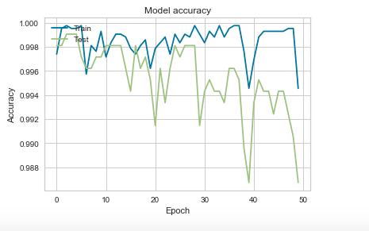
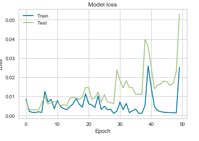

# CREDICXO_TECH
Please find the attached code for the task assigned here.
I have used a simple keras sequential neural net for the above task assigned.
The above methodology provided an accuracy of 0.99 and had minimum losses as depicted by the graphs below.

